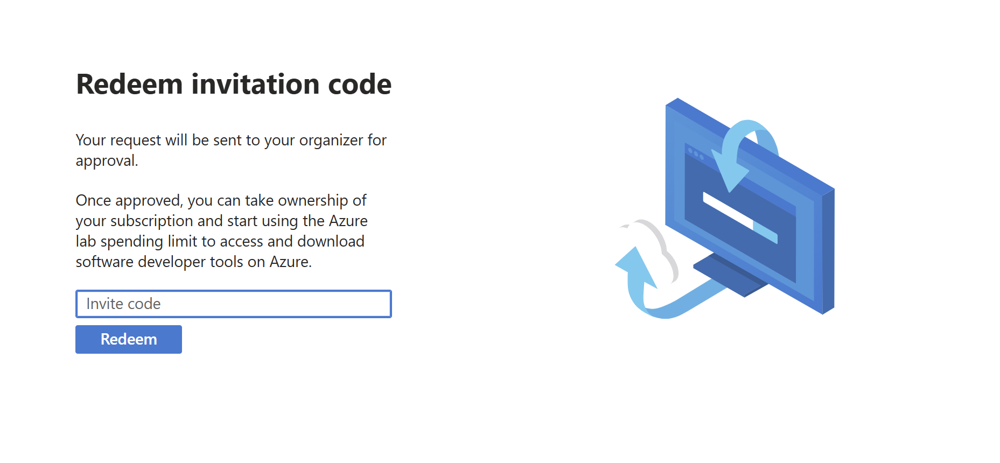
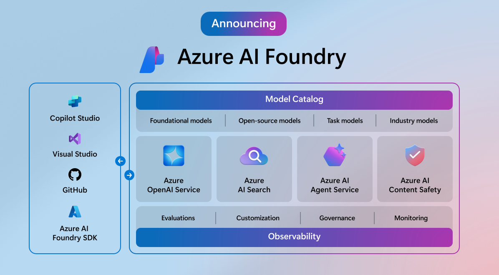
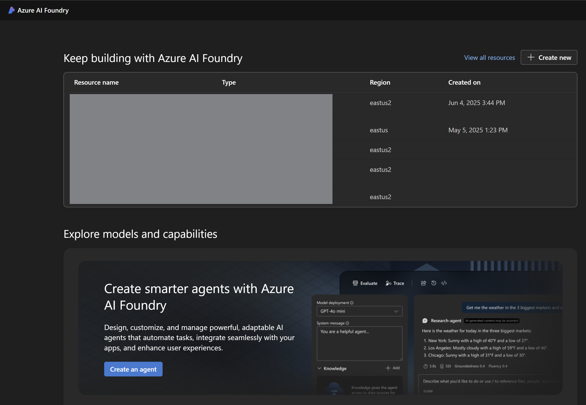
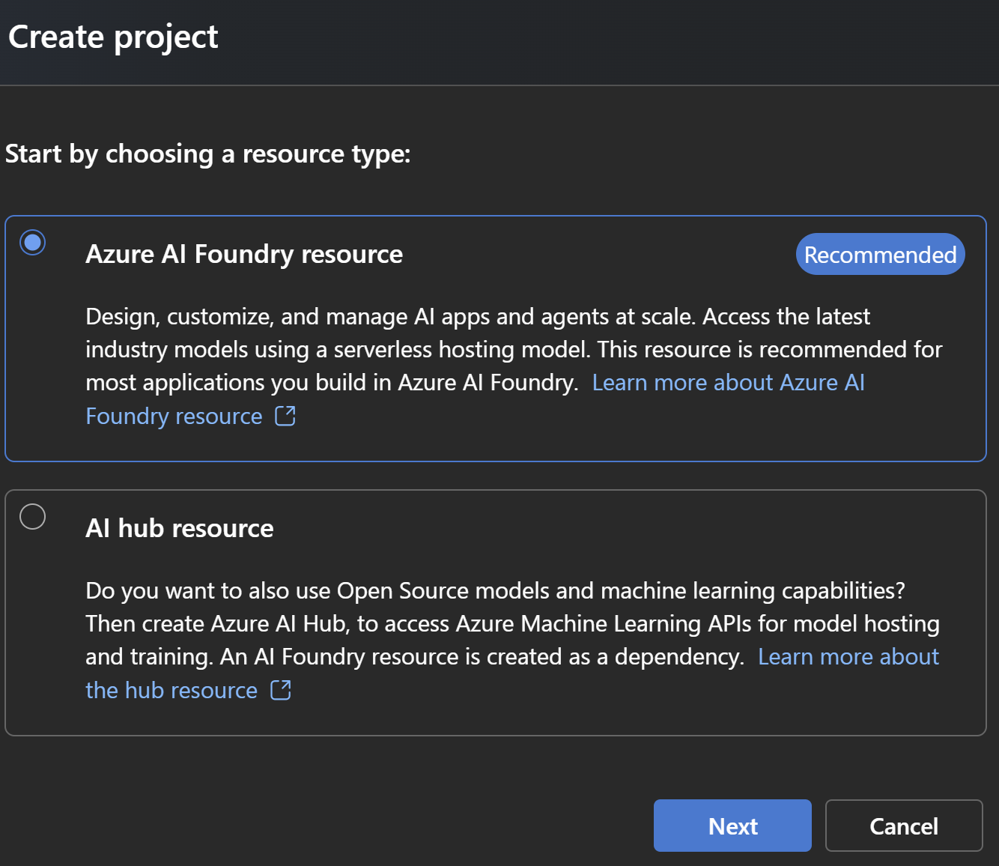
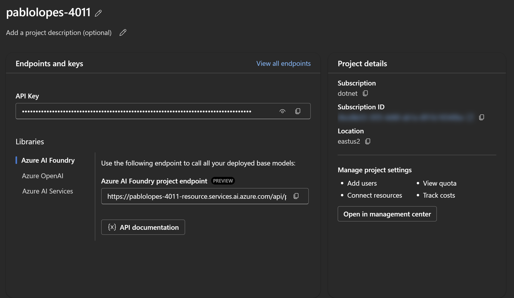
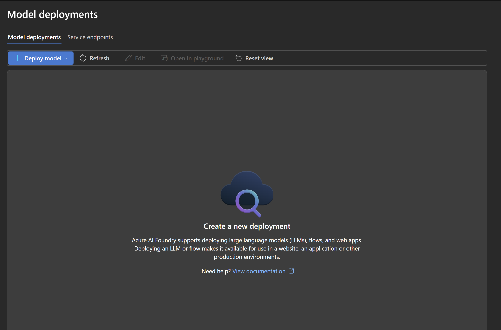
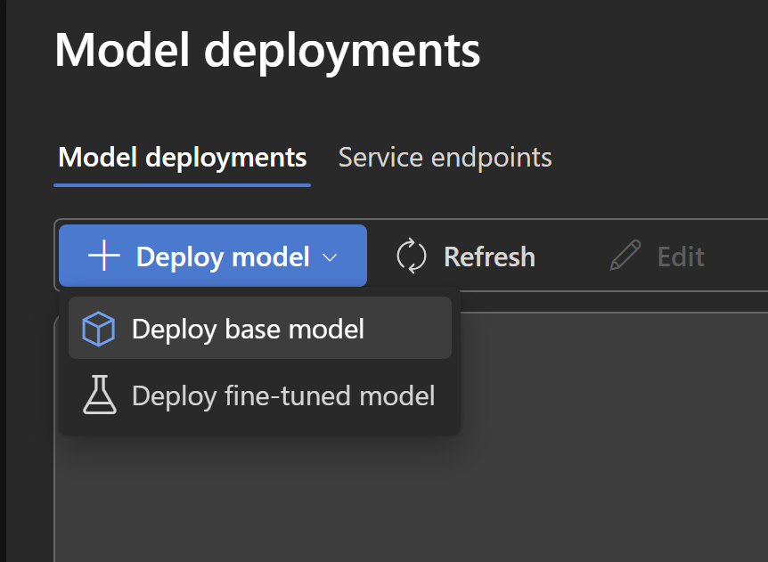
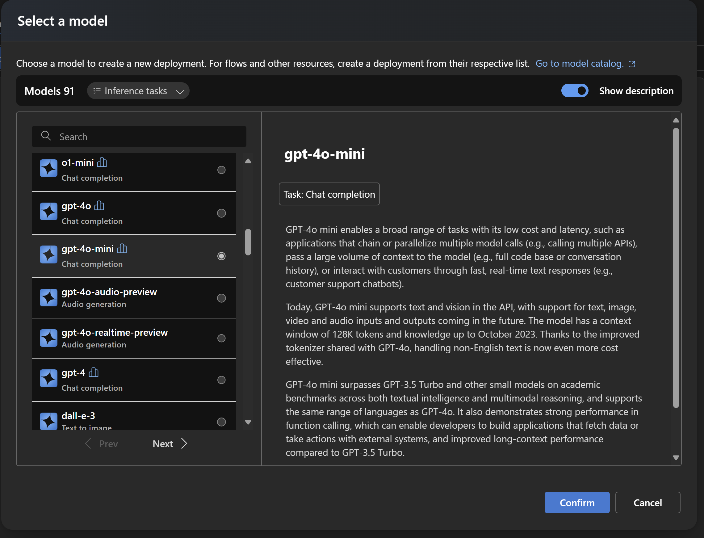
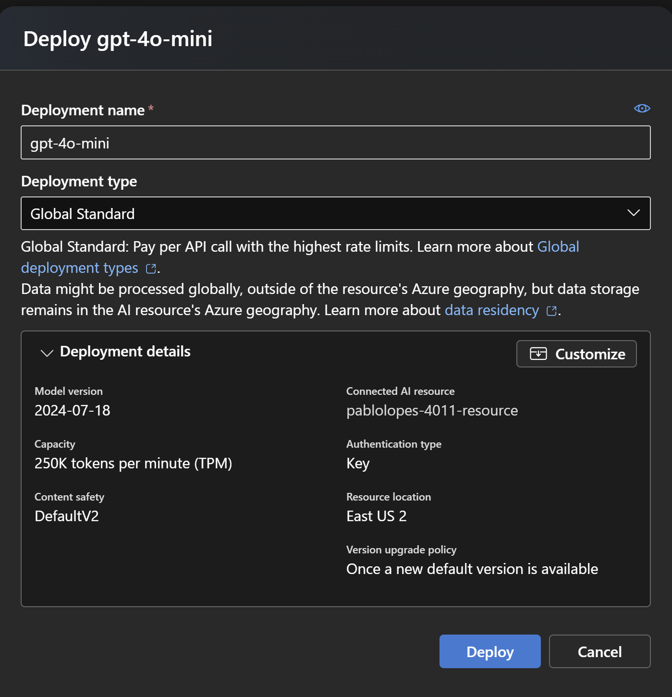
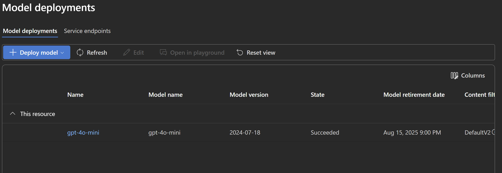

# Passo 1: Configurando o Ambiente

## Bem-vindo à Agentcon São Paulo 2025! 🎉

Olá, novo *futuro* engenheiro de agentes! Bem-vindo(a) à Agentcon São Paulo 2025, onde você dará os primeiros passos para se tornar um especialista em agentes inteligentes. Você está perto de embarcar na jornada de fazer um agente inteligente que pode interagir com dados, acessar ferramentas e gerar insights incríveis, por sua propia conta!

Primeiramente, gostaria de definir o que é um **agente inteligente**: é um sistema que pode tomar decisões, aprender com o ambiente e interagir com usuários ou outros sistemas de forma autônoma. Neste tutorial, você aprenderá a criar um agente inteligente usando .NET e ferramentas avançadas.

Sim, existem agentes mais complexos, como exemplo, multi-agentes, que utilizam Model Context Protocol (MCP), e outros, mas precisamos de começar por algum lugar, certo? Se você deseja aprender mais sobre esses agentes avançados, veja nosso guia sobre IA generativa em .NET [aqui](https://aka.ms/genainet).

## Pré-requisitos
Primeiro, vamos garantir que você tenha tudo pronto para começar:
- **.NET SDK**: Certifique-se de que o .NET SDK está instalado em sua máquina. Você pode baixá-lo [aqui](https://dotnet.microsoft.com/download).
- **Editor de Código**: Recomendamos o uso do Visual Studio Code ou Visual Studio para facilitar o desenvolvimento. Baixe o Visual Studio Code [aqui](https://code.visualstudio.com/). 
    - *Opcionalmente*, temos a opção de utilização do GitHub Codespaces, que permite que você codifique diretamente no navegador. Você pode acessar o Codespaces [aqui](https://github.com/features/codespaces).
- **Conta no Azure**: Você precisará de uma conta no Azure para acessar o Foundry e outras ferramentas necessárias. Se você ainda não tem uma conta, pode criar uma [aqui](https://azure.microsoft.com/free/). Não se preocupe, vamos fornecer créditos gratuitos para você começar!


## O que vamos construir?

Neste tutorial, você aprenderá a criar um **agente inteligente** completo com:
- 🛠️ **Acesso a ferramentas** de código e geração de infográficos
- 📚 **RAG (Retrieval-Augmented Generation)** com dados exclusivos da Agentcon
- 🔄 **Capacidade de iteração** para melhorar suas respostas

## Testando o .NET

Primeiro, vamos garantir que o .NET está funcionando corretamente em seu ambiente:

Abra o terminal (*Ctrl + `*) no VSCode ou no seu terminal preferido e execute o seguinte comando:

```bash
dotnet new console -n MeuPrimeiroAgente
```

Isso criará um novo projeto de console chamado "MeuPrimeiroAgente". Em seguida, navegue até o diretório do projeto e execute o comando:

```bash
cd MeuPrimeiroAgente
dotnet run
```

Você deve ver a mensagem "Hello, World!" no terminal.

## Instalando as Bibliotecas Necessárias

Agora que temos o .NET funcionando, precisamos instalar algumas bibliotecas essenciais para nosso agente. Abra o terminal no diretório do seu projeto e execute os seguintes comandos:

```bash
dotnet add package Azure.AI.Agents.Persistent
dotnet add package Azure.Identity
dotnet add package Microsoft.Extensions.Configuration
dotnet add package Microsoft.Extensions.Configuration.Json
```

Essas bibliotecas nos permitem, respectivamente, trabalhar com agentes persistentes no Azure, gerenciar autenticação e configurar nosso ambiente de desenvolvimento.

> **Dica**: Pode ocorrer que você precise instalar um pacote extra `Microsoft.Extensions.Configuration.Json` para a configuração JSON. Use o comando:

```bash
dotnet add package Microsoft.Extensions.Configuration.Json
```

## Créditos do Azure
Para garantir que você tenha acesso aos recursos necessários, vamos configurar os créditos do Azure. Se você ainda não tem créditos, siga estas etapas:

Entre no seguinte link: [https://aka.ms/JoinEduLab](https://aka.ms/JoinEduLab).

Se pedirá para logar na sua conta do Azure. Use a conta que você criou anteriormente ou faça login com uma conta existente.

Você será direcionado para a página de inscrição do Azure for Education. Você verá uma tela como esta:



Insira o código de convite fornecido durante o workshop da Agentcon São Paulo 2025. Após inserir o código, você será redirecionado para a página de educação, no qual você poderá ver o status dos seus créditos e recursos disponíveis. Qualquer coisa, notifique o palestrante caso tenha problemas.

> **Importante**: Você vai receber um e-mail para a entrada num tenant do Azure. Certifique-se de aceitar o convite para ter acesso aos recursos por esse tenant, ele requer MFA (Multi-Factor Authentication) para garantir a segurança da sua conta, favor tenha certeza de que você tem acesso ao seu celular ou outro método de autenticação configurado.


## Configurando o Azure CLI

 Caso você esteja utilizando o GitHub Codespaces, você já terá que instalar o Azure CLI, que é necessário para acessar os recursos do Azure. Você pode verificar se o Azure CLI está instalado executando o comando `az --version` no terminal. Caso não esteja instalado, você pode seguir as instruções de instalação [aqui](https://docs.microsoft.com/cli/azure/install-azure-cli). Ou utilizar o comando: 
```bash
curl -sL https://aka.ms/InstallAzureCLIDeb | sudo bash
```

## Criando Recursos no Foundry

Com nossa conta do Azure configurada, vamos criar os recursos necessários no AI Foundry para nosso agente inteligente. O AI Foundry é nossa *one-stop shop* para todos os recursos de IA.

Nele, você encontrará ferramentas para criar, treinar e implantar agentes inteligentes, além de acessar dados, modelos pré-treinados, evaluar modelos e fazer testes antes mesmo de dar *deploy* dos seus produtos que utilizem inteligência artificial.

 

Para acessar o Foundry, vá para o portal do Azure e procure por "AI Foundry". Você pode acessar diretamente pelo link: [AI Foundry](https://ai.azure.com).

Você verá uma tela como esta:


Agora, precisamos criar alguns recursos no Foundry, como um projeto e configurar as credenciais necessárias para acessar os dados e ferramentas que usaremos no nosso agente.

1. Acesse o portal do Foundry, clique em "Create new".

   

   Vai aparecer uma tela como esta, deixe a opção "Azure Ai Foundry Resource" selecionada e clique em "Next":

   

2. Crie um novo projeto, dê um nome e um grupo de recurso, se desejar, nas opções avançadas. Recomendo usar o nome grande que o Foundry lhe forneceu, como exemplo "pablonunes-1523". Clique em "Create".

   

   > **Dica**: O nome no Foundry deve ser único globalmente, assim você precisa escolher um nome que não esteja sendo usado por outra pessoa. Você pode adicionar números ou letras extras para garantir isso.

    Veja a tela de espera enquanto o Foundry cria o projeto:

    

   > **Importante**: O Foundry pode levar alguns minutos para criar o projeto. Seja paciente e aguarde até que o projeto esteja pronto.

3. Verifique se o projeto foi criado com sucesso. Você verá uma tela como esta:

    
    
    Agora, você tem um projeto no Foundry onde poderá criar e gerenciar seus agentes inteligentes. 

    Vamos utilizar o endpoint do Foundry para acessar os dados e ferramentas necessárias para o nosso agente. Não precisaremos utilizar a chave de API, pois vamos utilizar a autenticação do Azure para acessar os recursos.

4. Agora, precisamos, criar o modelo de Linguagem Natural que usaremos no nosso agente. Clique em "Models and Endpoints" no menu lateral esquerdo. Você verá uma tela como esta:

   

    Em seguida, clique em "Deploy Model" e depois, em "Deploy Base Model".

   

5. Escolha o modelo "gpt-4o-mini" e clique em "Next". Você verá uma tela como esta:

    

    Depois, você verá uma tela de configuração do modelo. Deixe as opções padrão e clique em "Next".

    

6. Depois, de criar você verá uma tela de resumo do modelo. Dados de acesso, como o endpoint e o nome do modelo, serão exibidos. Ignore esses pois usaremos o endpoint do Foundry que criamos anteriormente.

7. Pronto! Agora você tem um modelo de linguagem natural configurado no Foundry. Você pode ver o modelo na lista de modelos e endpoints.

    


## Próximos Passos

Com o ambiente configurado, estamos prontos para começar a construir nosso agente! No próximo passo, vamos criar a estrutura básica do nosso assistente.

Veja o próximo passo [aqui](Passo_2.md).

---

✅ **Checkpoint**: Certifique-se de que o .NET está rodando, as bibliotecas estão instaladas, créditos estão disponíveis e você tem acesso ao Foundry antes de prosseguir.